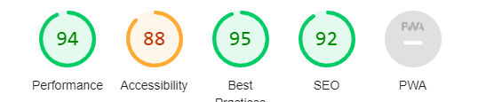

# Rock Paper Scissors

The Rock Paper Scissors website is a simple website for users looking to pass the time in playing the age old game of rock paper scissors, but this time, against a computer as their opponent.
This project is a simple interactive game of Rock, Paper, Scissors, where a player can play against the computer.

## Features

- Interactive design, enabling player choices.
- Score tracking and logging between player and machine.
- Responsive design for compatibility with smaller devices, though mobile phone devices did not yield as pleasing a UX as tablets and larger devices did. A revision of the media queries qould be needed for a future iteration of this project.
- Graphical display of the descisions made by both the end user and machine.

## Pattern Of Play

1. The end user can pick between rock, paper, or scissors by clicking the associated button.
2. The computer chooses a response both automatically and randomly.
3. The winner is determined as per the traditional rules of Rock, Paper, Scissors:
    - Rock beats Scissors
    - Scissors beats Paper
    - Paper beats Rock
4. If both the player and the computer choose the same hand, the round is a draw.
5. The first to reach 10 points wins the series. Disclaimer:: This however was a feature that I was unfortunately unable to carry out adequate testing in time to be able to deploy it into my project with confidence.

## Project Structure

- `index.html` 
- `assets/css/style.css` 
- `assets/js/script.js` 
- `assets/images/` 

# Testing

- I tested and can confirm that this page works in different browsers: Chrome, Firefox and Safari.
- I confirmed that this project is responsive, looks good and functions on most standard screen sizes using the devtools device toolbar in Chrome. Smaller mobile devices where less responsive. More time could have been affored to cater for that aspect.
- I confirmed that all components of the DOM are all readable and easy to understand.
- I have confirmed that the buttons work: each button generates an associated image when clicked with event listeners deployed effectively.

***Bugs***

*Solved Bugs*

- The main issues encountered throughout this project were in the form of the  ensuring that each button generates an associated image when clicked with event listeners deployed effectively. To achieve this I eventually leveraged Chatgpt feedback and validated it's efficiency once I could see that the correct images were rendering upon clickig the associated rock/paper/scissors button

**Validator Testing**

*HTML*
 - Minor errors were returned when passing through the official W3C validator, specifically, that 'element p not allowed as child of element ul' in the context of the footer.

*CSS*
- No errors found

*Accessibility*
 - I confirmed that the colors and fonts chosen are easy to read and accessible by running it through lighthouse in devtools

*Unfixed Bugs*

- No unfixed bugs. The full scope of the project saught to incorporate a game end functionality whereby the first contestant (user/machine) to reach a score of 10 would win the series, this resulting in the choice to continue and reset to a score of 0 each. While this is not strictly a bug, both poor time management and insufficient testing of this functionality meant that it was best to deploy without this feature for now. I would very much like to return to enhance this feature.

# Deployment

- The site was deployed to GitHub pages. The steps to deploy are as follows:
 - In the GitHub repository, navigate to the Settings tab
 - From the source section drop-down menu, select the Main Branch
 - Once the main branch has been selected, the page provided the link to the completed website.

 The live link can be found here: [Rock Paper Scissors](https://dfcoilrua.github.io/Project2_JS_RPS/)

# Credits

*Content*

- The code to create the function that set the image based on the user's choice of button was arrived at following a series of chatgpt prompts. This resource was leveraged for guidance as I was unable to successfully populate the correct rock/paper/scissors image using my own code.

*Media*

- Each of the three images for the Rock Paper and Scissors were cut from a single source and seperated into their individual images for the purposes of consistency in the illustraion ([https://img.pikbest.com/png-images/hand-rock-paper-and-scissor-clipart_1566427.png!w700wp](https://img.pikbest.com/png-images/hand-rock-paper-and-scissor-clipart_1566427.png!w700wp))
- The image for the guessing man on the player side or left hand side of the screen was taken from  ([https://media.istockphoto.com/id/697664430/vector/stick-figure-in-thinking-posture-stick-man-thinking-about-a-solution-to-a-question-vector.jpg?s=2048x2048&w=is&k=20&c=mHUMaIpsP45RlrzKR9NDZKNIKfdQhbFDZ0Hxo4EqjBs=](https://media.istockphoto.com/id/697664430/vector/stick-figure-in-thinking-posture-stick-man-thinking-about-a-solution-to-a-question-vector.jpg?s=2048x2048&w=is&k=20&c=mHUMaIpsP45RlrzKR9NDZKNIKfdQhbFDZ0Hxo4EqjBs=))
- The image for the guessing computer on the right hand side of the screen was taken from  ([https://www.vecteezy.com/vector-art/24182689-linear-style-question-mark-in-monitor-screen-icon](https://www.vecteezy.com/vector-art/24182689-linear-style-question-mark-in-monitor-screen-icon))

